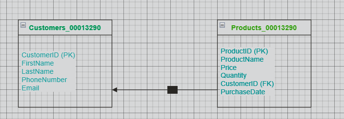

# WAD.CODEBASE.00013290

This application was developed for Web Application module, as coursework portfolio project @ WIUT by student ID: 00013290.

A comprehensive web application portfolio project for the Web Application module at WIUT. It includes an Angular SPA demonstrating CRUD operations, software design principles, and Swagger API documentation, as well as an ASP.Net Core API with Entity Framework.

**Student ID**: 00013290  
**Calculation**: 00013290 ÷ 20 = 664 with a remainder of 10  
**Assigned Topic**: Spare Parts Inventory 

## Prerequisites

Before running this project, the following shoul be installed on the system:

1. **Node.js** (v14 or later) - [Download Node.js](https://nodejs.org/)
2. **Angular CLI** (V18) - Install using `npm install -g @angular/cli`
3. **ASP.Net Core SDK** (v6.0 or later) - [Download .NET SDK](https://dotnet.microsoft.com/download)
4. **SQL Server** (or another compatible database system) - [Download SQL Server](https://www.microsoft.com/en-us/sql-server/)
5. **Visual Studio Code** (or any IDE of your choice) - [Download VS Code](https://code.visualstudio.com/)
6. **Git** - [Download Git](https://git-scm.com/)

### Optional Tools:
- **Postman** (for API testing) - [Download Postman](https://www.postman.com/)
- **Swagger** (built-in in the project for API documentation)

Ensure that system has access to a browser (e.g., Chrome) to view the Single Page Application (SPA).

## MoSCoW Prioritization

### Must Have
- Develop an ASP.Net Core API with Entity Framework.
- Implement database migrations with at least two foreign key-linked tables.
- Create CRUD operations in the API.
- Integrate Angular SPA with the API and demonstrate CRUD functionality.
- Swagger documentation for the API.
- Topic calculation and project naming conventions in all files.

### Should Have
- A visually appealing SPA design using a CSS framework.
- Clear explanation and screenshots of software design patterns applied.
- Detailed README with step-by-step setup instructions.

### Could Have
- Additional features like user authentication or authorization.
- Responsive design for SPA on mobile and desktop devices.

### Won't Have
- Features outside the scope of CRUD operations and API integration (e.g., advanced analytics or AI features).

### Justifications
**Must Have:**
 - Entity Framework and the ASP.Net Core API are necessary for the backend 
   functionality.
 - It is necessary to exhibit appropriate database structure and relationships when 
   migrating databases with foreign key-linked tables.
 - CRUD activities in the API: Essential to the project's operation.
 - Angular SPA with API integration: Full-stack development with a working SPA was 
   required.
 - Swagger documentation is necessary in order to display and document the API.
 - Project naming conventions: To avoid plagiarism and guarantee correct arrangement.
   
**Should Have:**
 - SPA using CSS framework that is aesthetically pleasing: improves user experience without sacrificing functionality.
 - Software design pattern explanation: crucial for showcasing project optimization, but less significant than key features.
 - README with instructions for setting up: Not as important as the primary functionality, but necessary for clarity.
   
**Could Have:**
 - The feature "User authentication or authorization" is optional and not necessary for the course work.
 - Although it is not necessary, responsive SPA design improves user experience.

**Won't Have:**
 - "Advanced features (e.g., analytics)": The work makes no mention of or requirement for these.

## Development Timeline

The GANTT chart below outlines the timeline and tasks required to complete this project within 48 hours, adhering to the coursework requirements. Tasks are structured based on dependencies, and optional enhancements are included if time permits.

### GANTT Chart
| **Task**                        | **Duration** | **Start Date/Time** | **End Date/Time** | **Dependencies**                         |
|---------------------------------|--------------|----------------------|-------------------|------------------------------------------|
| Set up project repository       | Done         | N/A                  | N/A               | None                                     |
| Add README with prerequisites   | Done         | N/A                  | N/A               | None                                     |
| MoSCoW prioritization and justifications | Done | N/A                  | N/A               | None                                     |
| **Design database schema**      | 2 hours      | Day 1, 00:00 AM       | Day 1, 02:00 AM   | None                                     |
| Create Data Access Layer (DAL)  | 2 hours      | Day 1, 11:00 AM      | Day 1, 1:00 PM    | Database schema                          |
| Create migrations for tables    | 1 hour       | Day 1, 1:00 PM       | Day 1, 2:00 PM    | Data Access Layer                        |
| Develop controllers for CRUD    | 4 hours      | Day 1, 2:00 PM       | Day 1, 6:00 PM    | Data Access Layer and migrations         |
| Test CRUD operations with Postman | 2 hours    | Day 1, 6:00 PM       | Day 1, 8:00 PM    | CRUD controllers                         |
| Integrate Swagger documentation | 1 hour       | Day 1, 8:00 PM       | Day 1, 9:00 PM    | CRUD controllers                         |
| Set up Angular SPA              | 2 hours      | Day 1, 9:00 PM       | Day 1, 11:00 PM   | API development                          |
| Create Angular components       | 4 hours      | Day 2, 7:00 AM       | Day 2, 11:00 AM   | Angular SPA setup                        |
| Integrate API with SPA          | 4 hours      | Day 2, 11:00 AM      | Day 2, 3:00 PM    | Angular components and functional API    |
| Test SPA and API integration    | 2 hours      | Day 2, 3:00 PM       | Day 2, 5:00 PM    | API integration                          |
| Write README documentation      | 2 hours      | Day 2, 5:00 PM       | Day 2, 7:00 PM    | Completed implementation                 |
| Record CRUD demo video          | 1 hour       | Day 2, 7:00 PM       | Day 2, 8:00 PM    | Completed SPA and API testing            |
| Optional: Add CSS enhancements  | 2 hours      | Day 2, 8:00 PM       | Day 2, 10:00 PM   | Completed SPA                            |

### Task Dependencies
- **Database Schema**: Required before creating the Data Access Layer (DAL).
- **Data Access Layer and Migrations**: Must be completed before developing controllers.
- **Controllers**: Required for CRUD functionality and testing with Postman.
- **Swagger Documentation**: Dependent on completed CRUD controllers.
- **Angular SPA Components**: Require the API to be functional for integration.

### Optional Enhancements
If time allows, the following optional tasks will be completed:
- CSS framework integration (e.g., Bootstrap) for better UI design.
- Adding responsive design elements to enhance usability on different devices.

## Database Schema

Below is the visual representation of the database schema used in the project:

This schema consists of two tables: **Customers** and **Products**, with a foreign key relationship between `Products.CustomerID` and `Customers.CustomerID`.

